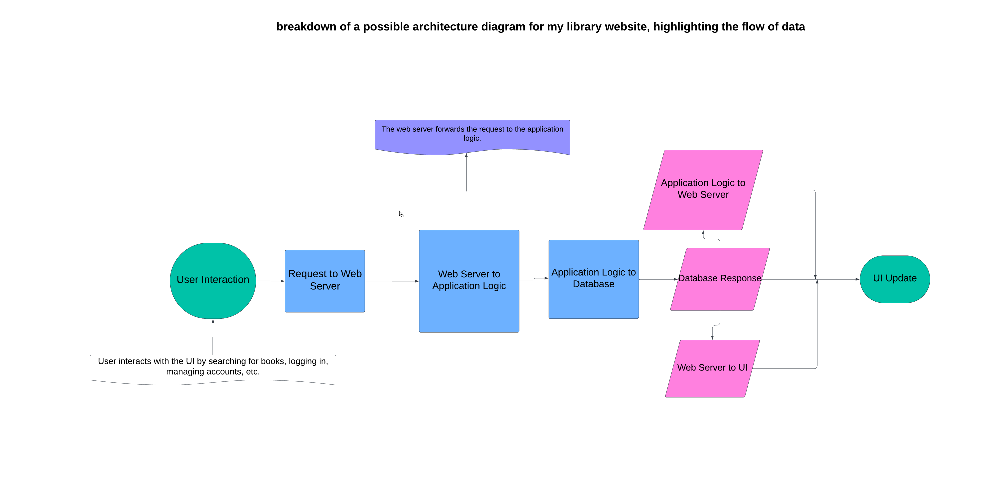
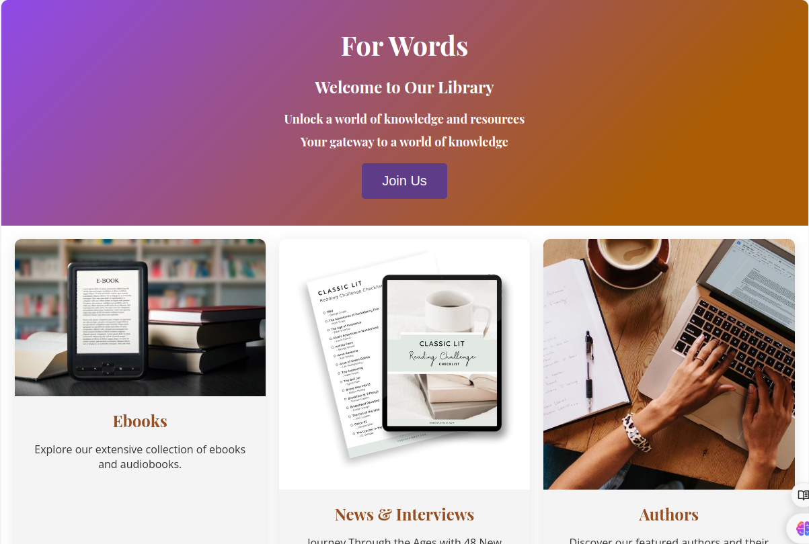

# Portfolio-Project

My First website - For Words Library

## What is For Words Library?

website aims to provide users with a comprehensive platform to explore information about books and authors. It will focus on frontend development, utilizing existing databases to showcase book and author data.
The website will offer an intuitive user experience, allowing users to easily navigate and discover Book World.

### Built with

Hana Abdalhag (Full-Stack Developer)

### Tech Stack

HTML, CSS, JavaScript (Frontend)
Python, Django (Backend)
PostgreSQL (Database)
Git (Version Control)
Heroku (Planned Deployment)
Why This Project Matters:

### This project is a chance to

Learn by doing: Apply your coding skills to build a real-world application.
Showcase your talent: Demonstrate your programming and problem-solving abilities.
Build your portfolio: Highlight a project you're passionate about.
Boost your confidence: See what you can create!

### Diagram of the architecture that clearly shows the flow of data

### the landing page

#### STAR Method

the most difficult technical challenge it was  Django Backend Challengethat I succeeded in solving using the STAR method
this is the details:

##### Situation

I was tasked with developing a new recommendation engine for the library website's backend using Django. The goal was to personalize book recommendations for each user based on their browsing history and borrowing patterns. However, integrating a recommendation algorithm efficiently into the existing Django framework presented several challenges.

##### Task

My responsibility was to design and implement the recommendation engine within the Django backend. This involved choosing an appropriate recommendation algorithm, integrating it seamlessly with the existing user model and book database, and ensuring scalability for a potentially large user base.

##### Action

Algorithm Selection: I researched different recommendation algorithms suitable for Django. I evaluated collaborative filtering and content-based filtering approaches based on their effectiveness and scalability. Considering the size and nature of our user data, I opted for a hybrid collaborative filtering technique.
Django Integration: I created a new Django model to store user-book interactions (e.g., browsing history, borrowing records). I extended the user model to include preferences or reading genres. I leveraged Django's database relationships and queries to efficiently retrieve user data and book information for the recommendation algorithm.
Scalability Considerations: I explored caching mechanisms to store frequently accessed user-book interactions and pre-computed recommendations for improved performance. Additionally, I optimized database queries and data structures to handle potential growth in the user base and book collection.
Testing and Deployment: I developed unit tests to ensure the recommendation engine functioned as intended and integrated it into Django's testing framework. Finally, I deployed the updated backend with proper configuration and monitoring to track performance and user experience.

##### Result

The implemented recommendation engine successfully personalized book recommendations for users. The hybrid collaborative filtering approach provided accurate suggestions based on user interaction and book content. By leveraging Django's functionalities and implementing caching and optimization techniques, the backend maintained performance even with a growing number of users. This project showcased my ability to overcome technical challenges within a Django backend environment.
Deep Dive: A Challenging Django Backend Feat - A Retrospective
This project, integrating a recommendation engine into the library website's Django backend, presented a significant technical hurdle. Overcoming it, however, yielded valuable technical takeaways, insights into potential improvements, and a deeper understanding of my own engineering strengths and areas for development. Let's delve deeper into these aspects.

#### Stay tuned

This project is under development, with exciting features like author profiles, community features, and interactive elements planned for the future.
